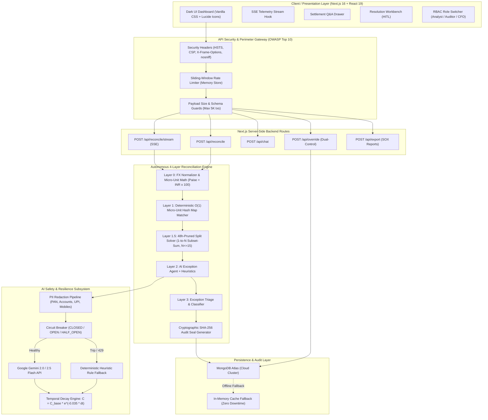
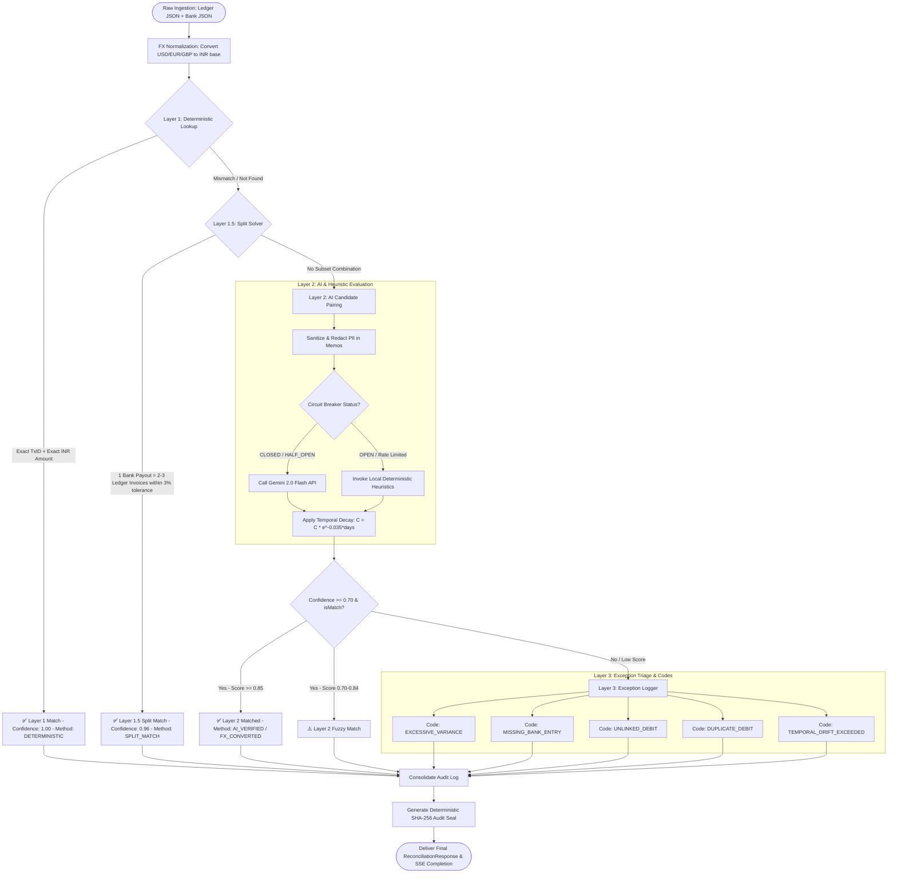
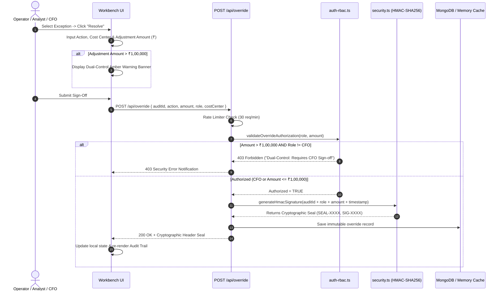
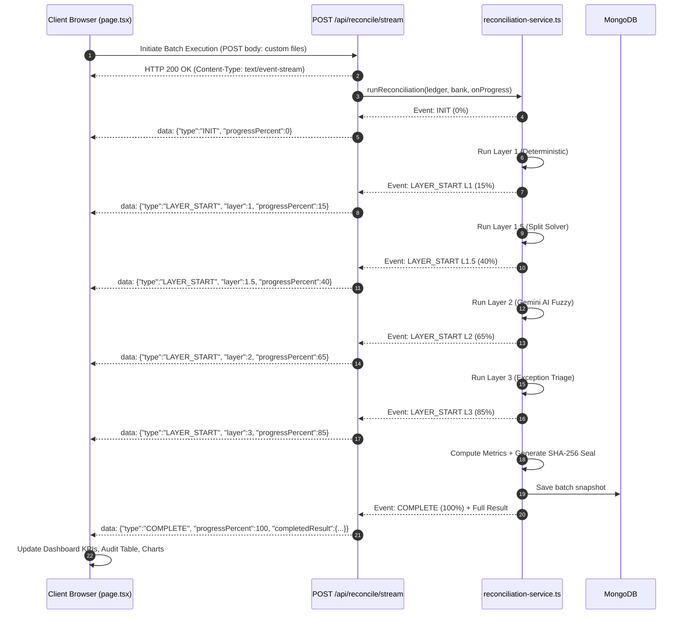

# 🏗️ AI Finance Controller — Architecture & System Design Diagrams

This document contains end-to-end architectural blueprints, flowcharts, security layers, and data pipelines for the **AI Finance Controller Platform**.

---

## 1. High-Level Enterprise System Architecture

---

## 2. 3-Layer Reconciliation Engine Pipeline

---

## 3. Security, RBAC & Dual-Control Governance Flow

---

## 4. Real-Time Telemetry & SSE Streaming Architecture

---

## 5. Architectural Component Matrix

| Component | Layer | Technology | Key Responsibility |
|---|---|---|---|
| **Presentation** | Frontend | Next.js 16 + React 19 | Pure black UI, SSE streaming, workbench modal, visual diff cards |
| **API Gateway** | Perimeter | Next.js Edge & Node | OWASP Security Headers (CSP, HSTS), Rate Limiter, Request Guards |
| **Layer 1** | Engine | In-Memory Map | O(1) exact TxID & normalized amount deterministic matching |
| **Layer 1.5** | Engine | Subset-Sum Solver | 1-to-N split payout resolution within 3% gateway MDR tolerance |
| **Layer 2** | AI Matching | Gemini 2.0 Flash + Heuristic | Semantic memo evaluation, TDS/Fee deduction, temporal decay |
| **Layer 3** | Governance | Classifier | Exception codification (`EXCESSIVE_VARIANCE`, `UNLINKED_DEBIT`, etc.) |
| **Circuit Breaker**| Resilience | State Machine | Zero-downtime automatic fallback on Gemini rate limits (429) |
| **Security & RBAC**| Auth / Compliance | Node Crypto + RBAC | PII Redaction, AES-256-GCM, >₹1L CFO Dual-Control signature gate |
| **Storage** | Persistence | MongoDB + Memory Fallback | Immutable audit trail storage with offline memory failover |
